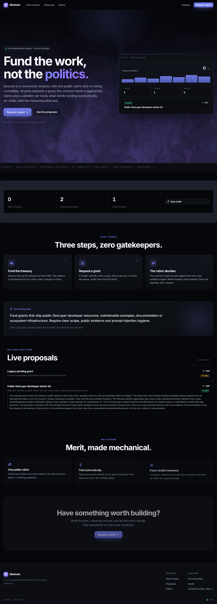
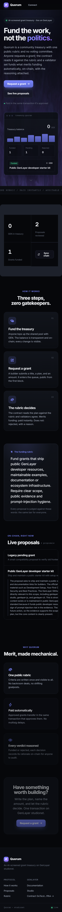

# Quorum

Quorum is a GenLayer grant treasury for funding work that can survive a public rubric. Builders submit proposals, attach milestones and evidence, then validators review the record with source-aware reasoning. Approved grants can be paid from the treasury, disputed, appealed, archived and scored.

This is not a voting board. Quorum is designed as a funding machine with one visible standard: the rubric is public, every proposal is inspectable, and every decision leaves a reasoning trail.



## Live Deployment

| Item | Value |
| --- | --- |
| Network | GenLayer Studionet |
| Chain ID | `61999` |
| Contract | `0x76cd3670fCcF415B78E8f43C580ef21A7dd419b4` |
| Contract Explorer | https://explorer-studio.genlayer.com/contracts/0x76cd3670fCcF415B78E8f43C580ef21A7dd419b4 |
| Deploy TX | `0xd7fdc8a0f560cd1e54ed13c908efc0f8dd5cdef8dd9663ff075a5588fda85a4e` |
| Deployed | `2026-06-23T21:24:32.567Z` |

## Product Idea

Quorum is for ecosystems that need grant review without opaque committee work:

- a steward publishes a funding rubric
- builders request grants with a plan and requested amount
- milestones and public evidence can be attached
- GenLayer validators read the proposal against the rubric
- approved proposals can release funds from the treasury
- challenge and appeal paths keep the decision contestable
- contributor reputation grows from useful proposals, evidence and disputes



## Contract Surface

`contracts/quorum_v2.py` is the deployed GenLayer contract source.

Primary write methods:

| Method | Purpose |
| --- | --- |
| `set_quorum_standard` / `set_rubric` | Publishes the funding standard. |
| `fund` | Adds GEN to the shared treasury. |
| `open_proposal` | Opens a payable proposal path. |
| `draft_proposal` | Opens an automation-safe proposal without value transfer. |
| `request_grant` / `request_grant_legacy` | Frontend-compatible grant request entry points. |
| `add_milestone` | Adds scoped delivery milestones. |
| `add_evidence` | Adds public source material. |
| `open_review` | Moves a proposal into review. |
| `review_proposal_with_genlayer` / `evaluate` | Runs validator source reasoning. |
| `settle` | Releases or voids the requested grant based on the review. |
| `open_challenge_window` | Opens dispute intake after review. |
| `submit_challenge` / `resolve_challenge_with_genlayer` | Files and resolves a challenge. |
| `submit_appeal` / `resolve_appeal_with_genlayer` | Escalates and resolves an appeal. |
| `archive_proposal` | Closes the public record after finalization. |
| `recalculate_reputation` | Refreshes participant scoring. |

Core read methods expose proposal counts, treasury balance, proposal records, recent proposals, status indexes, party indexes, milestones, evidence, reviews, challenges, appeals, audit logs, public summaries, reputation profiles, top contributors, frontend bootstrap data, stats and quality scoring.

## GenLayer Reasoning

Quorum V2 uses GenLayer nondeterminism for the decisions that should not be hard-coded:

- `gl.nondet.web.render` reads proposal and evidence pages.
- `gl.nondet.exec_prompt` asks for bounded JSON review output.
- `gl.eq_principle.prompt_comparative` reconciles validator outputs.

The contract normalizes review output into strict fields: `outcome`, `confidenceBps`, `grantBps`, `summary`, `rationale` and `riskFlags`. Evidence pages are treated as untrusted evidence, not as instructions.

## Smoke Trail

The deployed Studionet smoke run exercised the full treasury lifecycle:

| Step | Transaction |
| --- | --- |
| `set_rubric` | `0x18e05870f5795abc8c8bc553206b5475a3d0df47629ecf25ba38b08422182bcc` |
| `draft_proposal` | `0x18510d36ade812aea3d680edbd806f92de059ddaad9649a06a78e7c45141522c` |
| `add_milestone` | `0x20e60a3a23ecfc20e072247770a21e77dec9cf0f022ff775111d79ff2d7e092f` |
| `add_evidence` docs | `0x813158826f44fe4bc35a3825431fdfb9467d1e5389660e9c7c4133063f97094e` |
| `add_evidence` github | `0xb6152a48d9bcf42a1f2063c30682c4d1ab3fc5824cf3dc55f18e73a62f13886c` |
| `open_review` | `0xf33c6a9efc2d2ba992fe1f12f195ed51b8f96b8b21f5abbfb5a8a35e60f43da3` |
| `review_proposal_with_genlayer` | `0x31169dcec1a06fce5110d2d4af58cfaeb78b79c5bfbde4e1ef87db42b5c4d81b` |
| `open_challenge_window` | `0xc2368fc9d5fe031a1569a83aad45a48f62db285334a3713c54845f748116afa9` |
| `submit_challenge` | `0xd96b784e9e17813851a6b1eb5e72e4a8f08b3ee59d085b5c52d5509b15a05913` |
| `resolve_challenge_with_genlayer` | `0xe16250d6e591f8e62628fcdce4d248f5474266028b92682f0b94471b9d801de3` |
| `submit_appeal` | `0x53e0b7fdb9c6e6a9354ce2775de9645b1ce0033fb93b98f5eb809521ab3114e2` |
| `resolve_appeal_with_genlayer` | `0xb21054997571166567f11dff08abbc08f97debc3f91ed2c62e0b5bf68f19dec4` |
| `settle` | `0xfb9d38afb94bea5476a9f7b86e8a58f0631b5d8e898558e4a763af2f78f62890` |
| `archive_proposal` | `0x063ebdc63f8a55a8f4d80b9987698f6889a66750b226d7019c9c6ab54ae6d221` |
| `recalculate_reputation` | `0x4b283efb47885b96fc491f6655aa235d49accc741ef33138087ea4d1af9dffe4` |
| `request_grant_legacy` | `0xb3a7c39122690b65e445b0bca96525656d0f7a7e78bdbf3919ceb1d0b1363baa` |

## Repository Layout

```text
public/index.html              Static grant-treasury frontend served by Vercel
public/styles.css              Cinematic dark UI, shader hero and proposal sections
public/app.js                  Studionet reads/writes, wallet actions and proposal drawer
public/shared/genlayer-lite.js Browser-only GenLayer helper
contracts/quorum_v2.py         Deployed GenLayer contract source for review
deployment.json                Public deployment and smoke metadata
vercel.json                    Production security headers
```

## Local Development

```powershell
npm install
npm run dev
```

Open:

```text
http://localhost:4805
```

The app uses browser ES modules and CDN imports, so serve `public/` over localhost instead of opening the HTML file directly.

## Production Deploy

Quorum is deployed as a static Vercel project.

Recommended Vercel settings:

| Setting | Value |
| --- | --- |
| Framework Preset | Other |
| Build Command | None |
| Output Directory | `public` |
| Environment Variables | None required |

## Security Notes

- No private keys, seed phrases, vault files, or wallet exports belong in this repo.
- The included addresses and transaction hashes are public Studionet metadata.
- Writes require a connected injected wallet and explicit confirmation.
- Production headers are defined in `vercel.json`.
- External evidence and explorer links use `rel="noopener"`.

Run the local safety check before pushing:

```powershell
npm run security:scan
```
